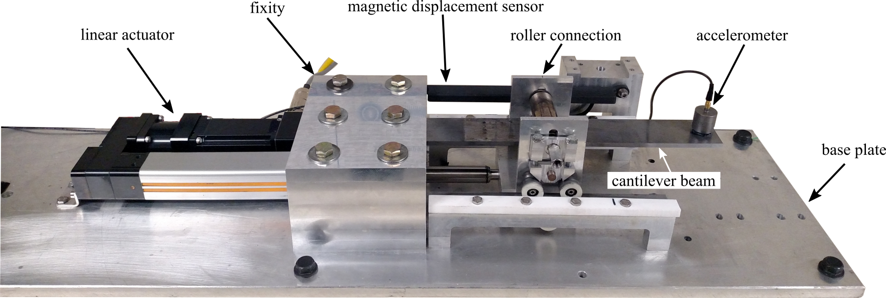
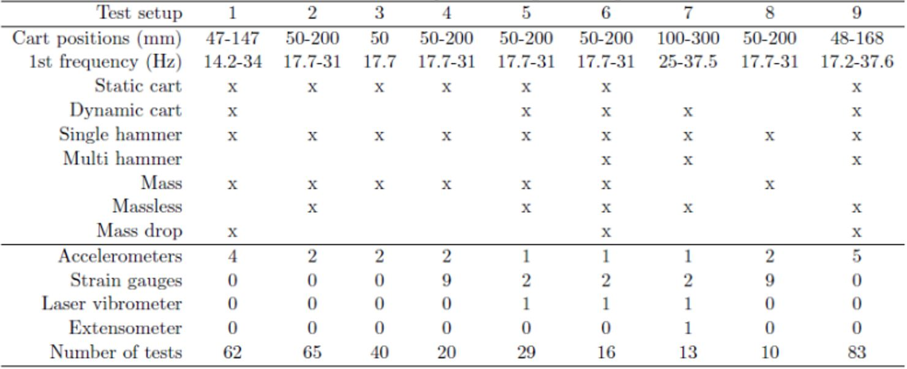

# Dataset 6 DROPBEAR Data
DROPBEAR Datasets from the submitted manuscript "Generated datasets from dynamic reproduction of projectiles in ballistic environments for advanced research ({DROPBEAR})".

DISTRIBUTION A: Approved for public release; distribution unlimited (AFRL-2022-3309)

  

Figure 1: The Dynamic Reproduction of Projectiles in Ballistic Environments for Advanced Research (DROPBEAR) experimental testbed with key components annotated. 

## [Datasets](data)

Table 1: DROPBEAR test setups used in generationg datasets.

1. Dataset 1 - 26Jul2018 to 28Aug2018
1. Dataset 2 - 17Sep2018
1. Dataset 3 - 3Jan2019
1. Dataset 4 - 21 Mar 2019
1. Dataset 5 - 17Sep2019, 19Sep2019, 25Sep2019
1. Dataset 6 - 29Oct2019
1. Dataset 7 - 15Jan2020
1. Dataset 8 - 21May2019
1. Dataset 9 – 23July2019 and 25July2019
1. Data for Setup 9 contains large volume of high-speed videos.  Due to space limit on GitHub, Dataset 9 is housed separately through the Box link below.  Please contact ywang-structures@hotmail.com if you have difficulty accessing.
  https://gatech.box.com/s/rmqxzc9clo0h9nam1xqm8ipbp9y2vbrh 

## [PPT](PPT)
PowerPoint version of the PDF slide deck in the main folder. Does contain some videos. 

## Licensing and Citation

[comment]: <> ([![CC BY-SA 4.0][cc-by-sa-shield]][cc-by-sa])

This work is licensed under a  xxx

[comment]: <> ([Creative Commons Attribution-ShareAlike 4.0 International License][cc-by-sa].)

[cc-by-sa]: http://creativecommons.org/licenses/by-sa/4.0/
[cc-by-sa-image]: https://licensebuttons.net/l/by-sa/4.0/88x31.png
[cc-by-sa-shield]: https://img.shields.io/badge/License-CC%20BY--SA%204.0-lightgrey.svg

@Article{Nelson2022GeneratedDatasetsDynamic,   
  author = {Matthew Nelson and Simon Laflamme and Chao Hu and Adriane G.Moura and Jonathan Hong and Austin Downey and Peter Lander and Yang Wang and Erik Blasch and Jacob Dodson.},   
  howpublished = {GitHub},  
  title  = {Generated datasets from dynamic reproduction of projectiles in ballistic environments for advanced research ({DROPBEAR})},   
  year   = {2022},  
  journal = {Data in Brief},    
  url    = {https://github.com/High-Rate-SHM-Working-Group/Dataset-6-DROPBEAR_data},    
}

